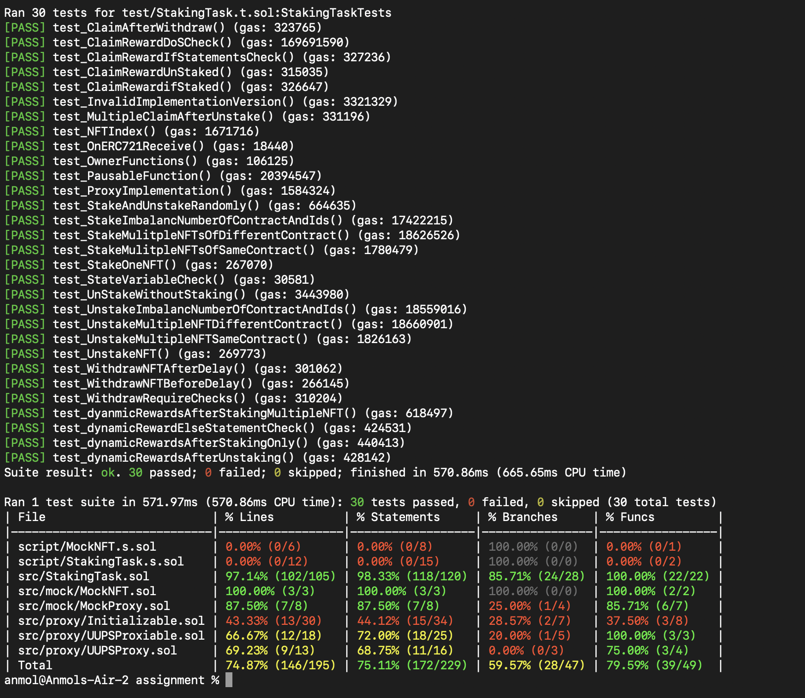

# DZap Smart Contract Task

### Task Description

- Staking NFT and get rewards per block
- Staking should be pausable
- user can claim rewards after a delay time
- user can withdraw nft after delay time
- owner can change rewards per block, claim delay, withdraw delay

### Deployment Scripts

```solidity
# To load the variables in the .env file
source .env

# To deploy and verify staking contract
forge script --chain sepolia script/StakingTask.s.sol --rpc-url $SEPOLIA_RPC_URL --broadcast --verify -vvvv

# To deploy and verify mockNFT contract
forge script --chain sepolia script/MockNFT.s.sol --rpc-url $SEPOLIA_RPC_URL --broadcast --verify -vvvv

```

### Test scripts

```solidity
forge test
```


### Test Results


